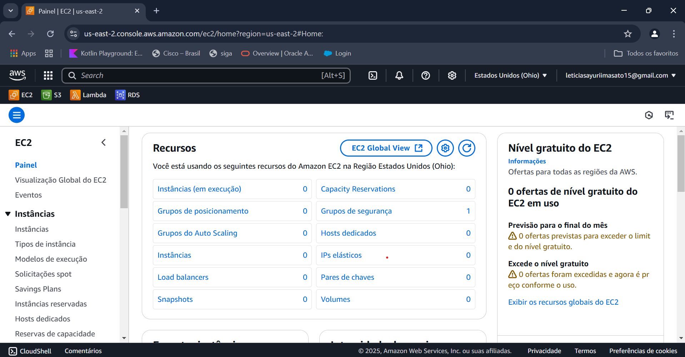
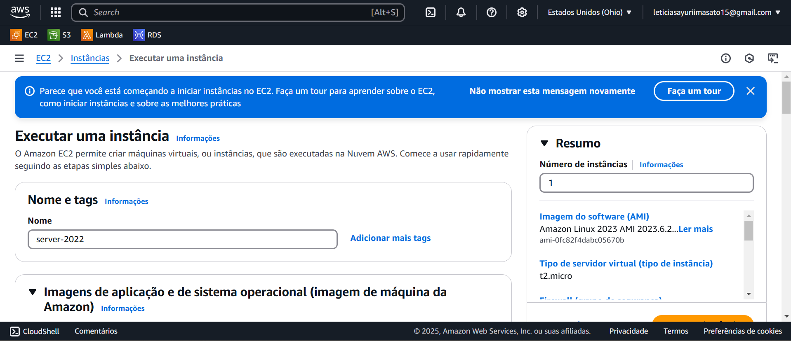
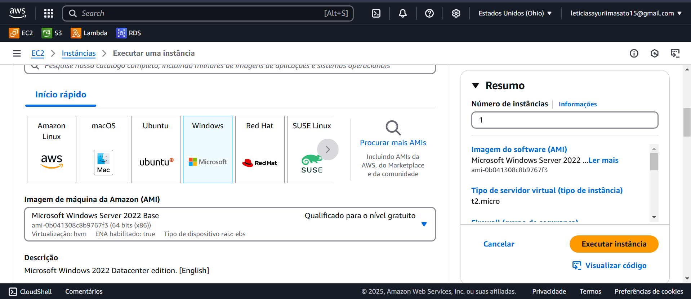

## Amazon EC2 (Elastic Compute Cloud)

O **Amazon EC2** (Elastic Compute Cloud) é um serviço da AWS que fornece capacidade computacional escalável na nuvem. Ele permite que usuários criem e gerenciem instâncias de servidores virtuais (chamadas de instâncias EC2) de forma flexível e sob demanda.

### Características Principais
- **Escalabilidade**: Permite aumentar ou diminuir a capacidade computacional conforme necessário.
- **Modelos de Preço**:
  - **On-Demand**: Paga-se apenas pelo uso por hora ou segundo.
  - **Reserved Instances**: Planos com desconto para uso a longo prazo.
  - **Spot Instances**: Instâncias com preços reduzidos baseados em demanda e oferta.
  - **Savings Plans**: Compromisso de uso por um período com desconto.
- **Segurança**: Integração com **AWS IAM**, **VPC**, **Security Groups** e **Key Pairs**.
- **Variedade de Instâncias**: Diversos tipos otimizados para diferentes workloads (CPU, memória, armazenamento, GPU).
- **Elastic Load Balancing (ELB)**: Distribui o tráfego entre várias instâncias para alta disponibilidade.
- **Elastic Block Store (EBS)**: Armazenamento persistente para as instâncias EC2.

### Casos de Uso
- Hospedagem de aplicativos web e APIs.
- Execução de bancos de dados e aplicações empresariais.
- Machine Learning e Big Data.
- Ambientes de desenvolvimento e teste.
- Computação de alto desempenho (HPC).

Amazon EC2 é uma solução poderosa para empresas que precisam de flexibilidade e controle sobre sua infraestrutura na nuvem.

## Passos para acessar EC2 e Iniciar a criação

### Painel do EC2

### Nome e Tags do EC2

### Escolher máquinas de nível gratuito

****

Aproveite sua conta da AWS e repita sempre esse processo, crie e apague diversas VMs, lembre, a prática leva a perfeição!!!!! Cuidado com seu cartão de crédito!

## Amazon S3 (Simple Storage Service)

*(Conteúdo a ser adicionado posteriormente.)*
